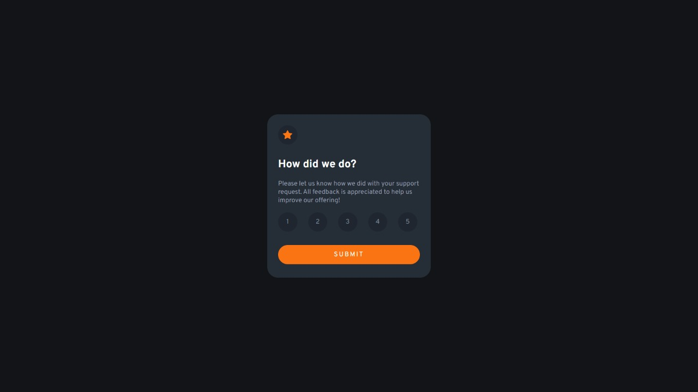

# Frontend Mentor - Interactive rating component solution

This is a solution to the [Interactive rating component challenge on Frontend Mentor](https://www.frontendmentor.io/challenges/interactive-rating-component-koxpeBUmI). Frontend Mentor challenges help you improve your coding skills by building realistic projects. 

## Table of contents

- [Overview](#overview)
  - [The challenge](#the-challenge)
  - [Screenshot](#screenshot)
  - [Links](#links)
- [My process](#my-process)
  - [Built with](#built-with)
  - [What I learned](#what-i-learned)
  - [Continued development](#continued-development)
- [Author](#author)

## Overview

### The challenge

Users should be able to:

- View the optimal layout for the app depending on their device's screen size
- See hover states for all interactive elements on the page
- Select and submit a number rating
- See the "Thank you" card state after submitting a rating

### Screenshot



### Links

- Solution URL: [Solution](https://github.com/adityasri12/Interactive_Rating_Component_Main/blob/main/index.html)
- Live Site URL: [Add live site URL here](https://your-live-site-url.com)

## My process

### Built with

- HTML
- CSS custom properties
- CSS flex
- Responsive design
- Javascript and DOM

### What I learned

```js
function c1(){
	if (rating != "0"){
		document.getElementById("cont" + rating).style.color = "hsl(216, 12%, 54%)";
		document.getElementById("cont" + rating).style.background = "rgba(31,38,48,255)";
	}
	document.getElementById("cont1").style.color = "white";
	document.getElementById("cont1").style.background = "hsl(217, 12%, 63%)";
	rating = "1";
}
```

### Continued development
I would further like to extend my knowledge in fields like:-
 - Ecommerce websites
 - Php
 - profile and dashbord creation for users

## Author

- Website - [Aditya Srivastava](http://getbot.epizy.com/)
- Frontend Mentor - [@adityasri12](https://www.frontendmentor.io/profile/adityasri12)
